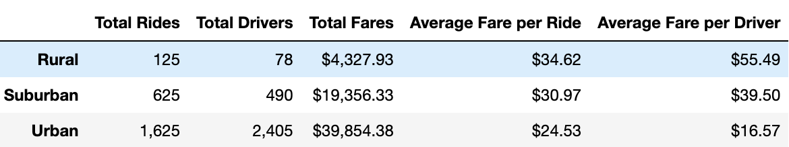
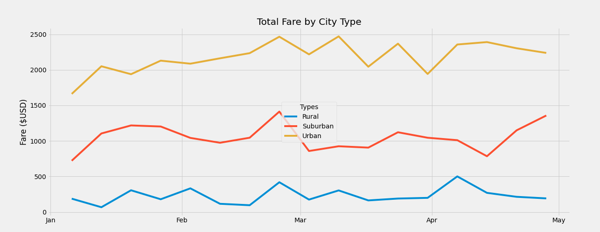

# PyBer_Analysis

## Overview 
The main goal of the analysis is to understand the relationship between the type of the city - Rural, Suburban, Urban -  and the numbers of drivers and riders in The Pyber company, a ridesharing app. The data will be analyzing is from January to early May of 2019.
## Resources 
- Data source: .csv
- Software: Pandas, Jupyter Notebook 6.4.8
## Results 
first things first, to get to the result i had to complete some tasks:
1. Merge two datasets 
2. Get the total rides for each city type
3. Get the total drivers for each city type
4. Get the total amount of fares for each city type
5. Get the average fare per ride for each city type
6. Get the average fare per driver for each city type

.

After all, you can see by the data frame that Urban cities have significantly more drivers, riders and higher fares than the other types, but if it compares the average fares per ride and per drive, the Rural city has increased fares. One of the reasons for these results may be the distance to get to the Rural city. 

.

## Summary 

- Reward the driver also for passenger ratings, allowing his fare to increase for the service given.
- Consider the distance and the time to get to the destination, taking into account the traffic in the city and also the distance to rural cities.
- Increase the number of drivers in rural cities, have more offers and balance the average fare.
